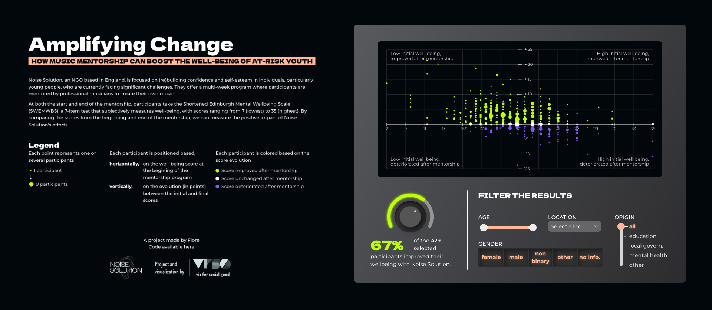

# Amplifying change: Visualising the impact of Noise Solution



An [interractive data visualisation project](https://wildvariables.github.io/vfsg-noise-solution/) made with Svelte and d3.js to visualise the impact of the NGO [Noise Solution](https://www.noisesolution.org/). This project is a contribution to a [Viz for Social Good](https://www.vizforsocialgood.com/)'s project.

## Installation

```bash
$ npm install
```

## How to Run for Development

```bash
$ npm run dev
```

## How to build for deploy

```bash
$ npm run build
```
